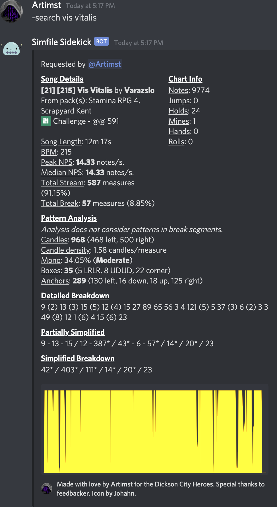

# Simfile Sidekick

A discord bot to scan and parse StepMania simfiles. Inspired by Nav's Breakdown Buddy.



## About this guide

This guide was tailored for linux users, however I've gotten everything to work locally on macOS using the same steps (minus the systemd section, of course).

I don't have any advice for Windows users unfortunately, as I haven't coded on a non-UNIX system in awhile. Feel free to update this readme if there are any hiccups running this on Windows. That being said, I would be surprised if there were any additional issues given how small this application is.

## How to use

This was created and tested using Python 3.6.9, but will probably work with earlier versions of Python 3.

You'll need to install a few packages before using, most easily done using pip.

I use Plotly for the density graph creation. It is open source:
https://github.com/plotly/plotly.py

`pip install plotly`

Plotly has a dependencies on psutil and kaleido:

`pip install psutil`

`pip install kaleido`

I also use TinyDB to create the database. It essentially creates a JSON file, but figured a full-blown database was outside the scope of this project. It is also open source:
https://github.com/msiemens/tinydb

`pip install tinydb`

The actual discord bot, bot.py, has dependencies on discord and python-dotenv:

`pip install discord`

`pip install python-dotenv`

It also requires gdown to download song packs from Google Drive right within discord:

`pip install gdown`


You'll want to run scan.py first, then after generating the database, you can run bot.py.

### scan.py

This file will scan a directory (and subdirectories) for a list of .sm files. It will parse through each .sm file, and retrieve useful information (such as rating, steps, pattern analysis and detailed density breakdown) and append it to a database (in our case, the TinyDB JSON file).

Note: Scanning a songs folder that has a few thousand songs will take a few hours (usually I let it run overnight).

To use:

`python3 scan.py -d "/home/steve/simfile-sidekick/songs"`

List of all command line options:

`-v` is verbose. It will output the song currently being scanned to stdout.

`-r` is rebuild. It will delete and completely rebuild the database. Normal behavior (without this flag) is to simply append new songs to the database.

`-m` is remove media. It will delete any .ogg, .mpg, or .avi files it finds. This is useful when scanning new packs if you wish to save disk space - the only thing we need is the .sm file.

`-d` is directory, and a mandatory option. It is the directory where all your song packs are located.

`-l` is log. It will generate a log file and output errors to it. At a later date I will add a parameter to this that will filter out different log levels. They are:
- INFO: Generic parsing messages for songs.
- WARN: Something is wrong in the file but scan.py was able to handle and proceed with processing.
- ERROR: A file was skipped due to an unhandled exception or error.

`-u` will execute the unit tests. It supercedes every other flag, and will generate its own db.json and log file in the tests directory. Results will be sent to stdout. 

When finished, you should have a new db.json file in the same folder as scan.py.

### bot.py

This is the actual discord bot. It will search db.json for songs matching the entered criteria and return it to the user. If multiple matches are found, it will return a list for the user to select from.

Before actually running bot.py, you will need a .env file in the same folder as bot.py. Inside the .env file should contain a line:

`DISCORD_TOKEN=YourBotsDiscordToken`

If you unfamiliar with integrating your script with Discord (or more importantly: why it's important to keep your bots token separate), I recommend reading https://realpython.com/how-to-make-a-discord-bot-python/ as this is the guide I followed in creating this bot.

To use:

`python3 bot.py`

## Tips

- I highly recommend using screen when using scan.py. Your first scan will take more than a few hours. See https://linuxize.com/post/how-to-use-linux-screen/
- If you never used python pip, see https://pip.pypa.io/en/stable/installing/
- For active development, I recommend running python with the `-B` flag to prevent the creation of the `__pycache__` folders. I've had issues where results from the database aren't retrieved properly when working on the unit tests. 
- For linux users, if you wish to set bot.py as a systemd service (to allow the bot to start with the system), here is my .service file I created in `/etc/systemd/system` (I called it discordss.service):

```
[Unit]
Description=Simfile Sidekick bot for Discord
After=network.target

[Service]
WorkingDirectory=/home/steve/simfile-sidekick
Type=simple
Restart=always
RestartSec=5
User=steve
ExecStart=/usr/bin/python3.6 /home/steve/simfile-sidekick/bot.py

[Install]
WantedBy=multi-user.target
```

You can then run the commands `systemctl daemon-reload` to load your new service, `systemctl enable discordss` to load the bot on boot, and `systemctl start discordss` to start the bot immediately.

## Troubleshooting

- If you need to install pip and getting an error like:

`ModuleNotFoundError: No module named 'distutils.util'`

Just install python3-distutils:

`sudo apt-get install python3-distutils`


- If you're trying to install psutil and getting and error like:

`error: command 'x86_64-linux-gnu-gcc' failed with exit status 1`

Then install python3-dev:

`sudo apt-get install python3-dev`

- If you're getting 2 or more responses from the discord bot, you most likely have 2 or more processes of bot.py running.

## To-do
- [x] Replace all references of "Breakdown Buddy Jr." with "Simfile Sidekick"
- [x] Log songs that couldn't be parsed by scan.py to a logfile
- [ ] Flag in scan.py to enter in a database name
- [ ] Create a tool to insert/update/delete from the TinyDB database
- [ ] Search by different or multiple parameters (e.g. artist, stepartist, ranking, etc.)
- [x] Parse manually uploaded .sm files from discord
- [x] Preferences for users (hide title & artist and other original Breakdown Buddy features)
- [x] Unit testing and built-in debug options
- [x] Admin tools to add/remove packs from within Discord
- [ ] Investigate if switching to msdparser is worthwhile
- [ ] Review pattern analysis and mono calculation
- [ ] Add option/logic to treat 16ths as break if runs are 24ths/32nds
- [ ] Code cleanup. DBManager files should handle all the json parsing. I currently have it scrambled through the code. I'm sorry.